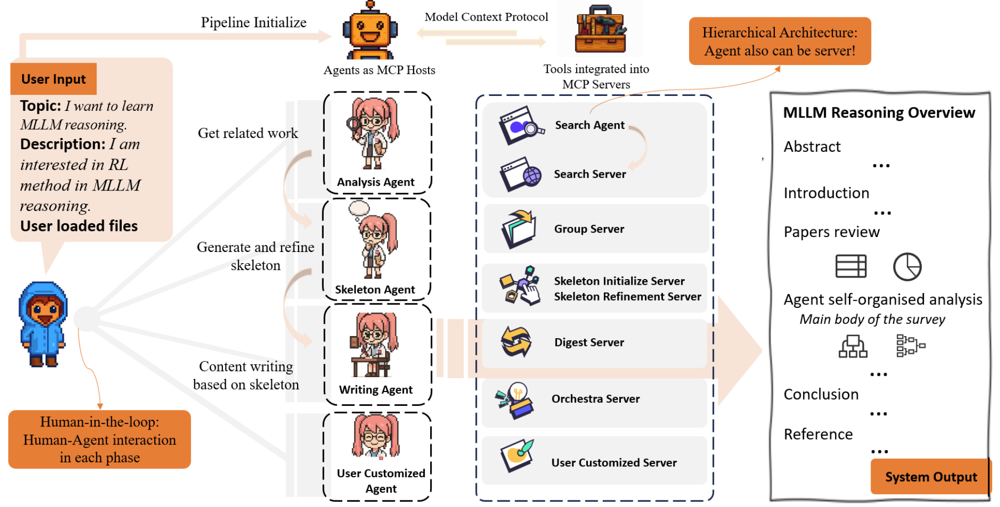

# LLMxMapReduce_V3

## Introduction
we introduce LLM×MapReduce-V3, an interactive, modular, and self-organized multi-agent system for academic survey generation. Building upon LLM×MapReduce-V2, our framework leverages the Model Context Protocol to enable composable modules, adaptive planning, and human-in-the-loop alignment. The system supports dynamic workflows through an agent-level planner, allowing flexible orchestration of modules such as document digestion, skeleton construction, and survey writing.



## Quick Start
### Environment Setup
#### 1. Install uv
```bash
# (Optional) Upgrade pip
pip install --upgrade pip

# Install uv
pip install uv
# Or use Homebrew (macOS/Linux)
brew install uv
```
#### 2. Create and Activate a Virtual Environment
```bash
cd LLMxMapReduce_V3

# Create a new environment
uv venv

# Activate environment
# Linux /macOS
source .venv/bin/activate
# Windows Powershell
.venv\Scripts\Activate.ps1

# Check
which python
```
#### 3. Install Dependencies
```bash
uv pip install -r requirements.txt
```
### Configure APIs
Edit config/unified_config.json with your API keys and endpoints.
Supports OpenAI plus search engines (SerpAPI, Bing, Google):
```json
    "api_keys": {
        "openai": {
            "api_key": "YOUR_OPENAI_KEY",
            "base_url": "YOUR_OPENAI_URL"
        },
        "search_engines": {
            "serpapi_key": "",
            "bing_subscription_key": "",
            "google_custom_search": {
                "api_key": "",
                "search_engine_id": ""
            }
        }
    },
```
### Start Survey Writing
```bash
bash scripts/start.sh "Your Topic" "Your Description"
```
When a .jsonl file appears in output/date/topic, stop with Ctrl+C and convert to Markdown:
```bash
python scripts/output_to_md.py
```